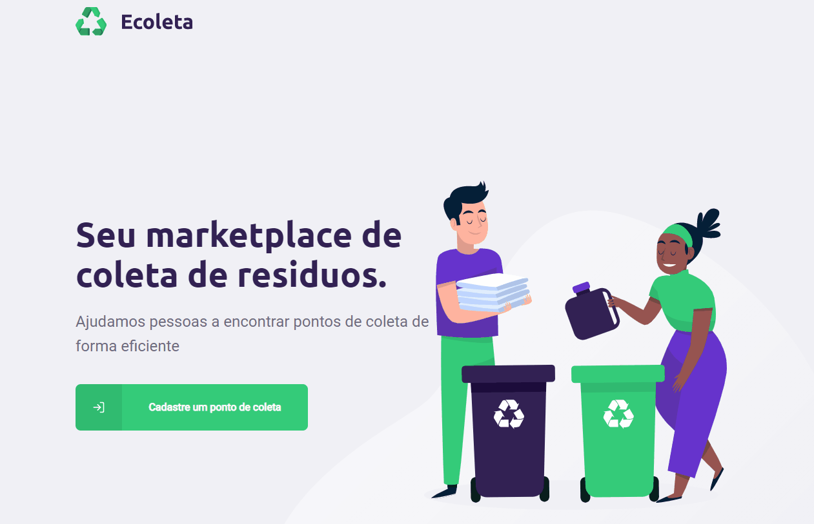

<h1 align="center">
  
</h1>

<p align="center">
  <a href="#-tecnologias">Tecnologias</a>&nbsp;&nbsp;&nbsp;|&nbsp;&nbsp;&nbsp;
  <a href="#-executando">Executnado</a>&nbsp;&nbsp;&nbsp;|&nbsp;&nbsp;&nbsp;
  <a href="#-projeto">Projeto</a>
</p>

---

<p align="center">
    
    &nbsp;&nbsp;&nbsp;
    
</p>

<p align="center">
  
</p>

<br>

### 🚀 Tecnologias
---

- [Node.js](https://nodejs.org/en/)
- [React](https://reactjs.org)
- [React Native](https://facebook.github.io/react-native/)
- [Expo](https://expo.io/)
- [TypeScript](https://www.typescriptlang.org/)

### 💻 Projeto
---

O E-coleta é uma aplicação que conecta pessoas a locais de descarte de resíduos recicláveis, no intuito de ajudar a preservar o mundo 🌱

Projeto desenvolvido na NextLevelWeek 01 da [Rocketseat]([https://link](https://rocketseat.com.br/)) !

### 📦 Executando
---
Para rodar o projeto localmente:

```bash
  # Clona o repo
  $ git clone https://github.com/verissimo-sn/nlw-ecoleta.git

  # Entra na pasta server
  $ cd server

  # Instala as dependências
  $ yarn install

  # Roda o projeto
  $ yarn dev

  ##########################

  # Entra na pasta web
  $ cd web

  # Instala as dependências
  $ yarn install

  # Roda o projeto
  $ yarn start

```
